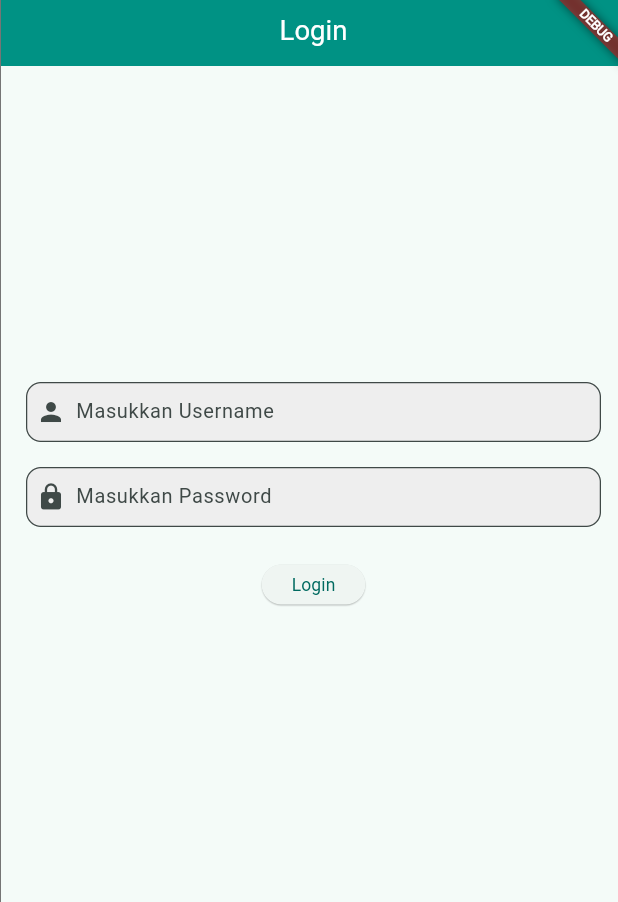
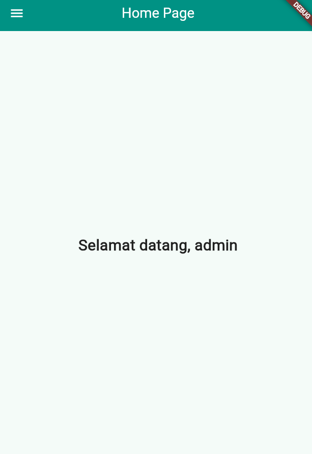
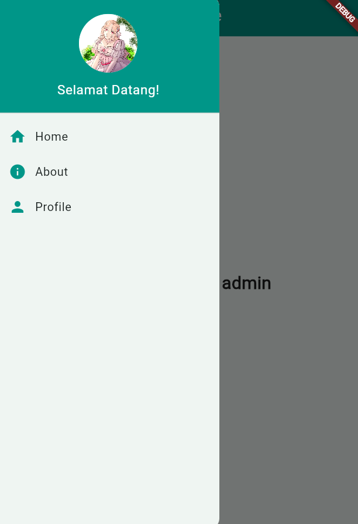
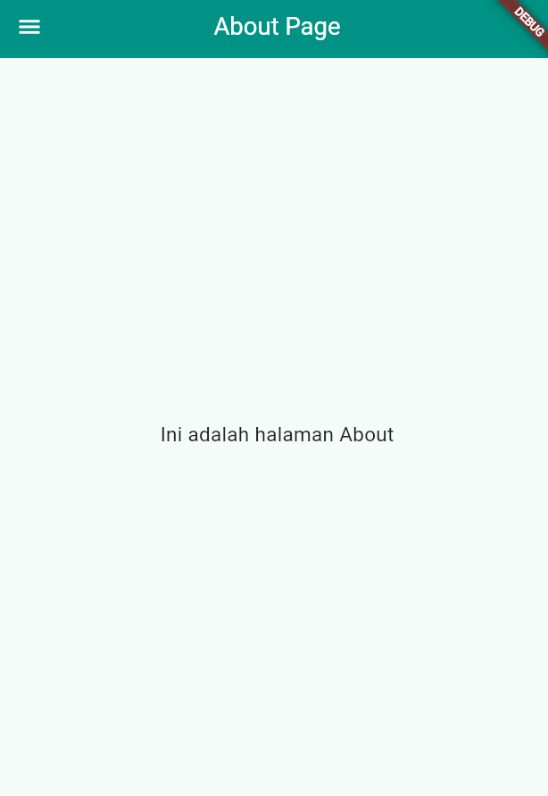
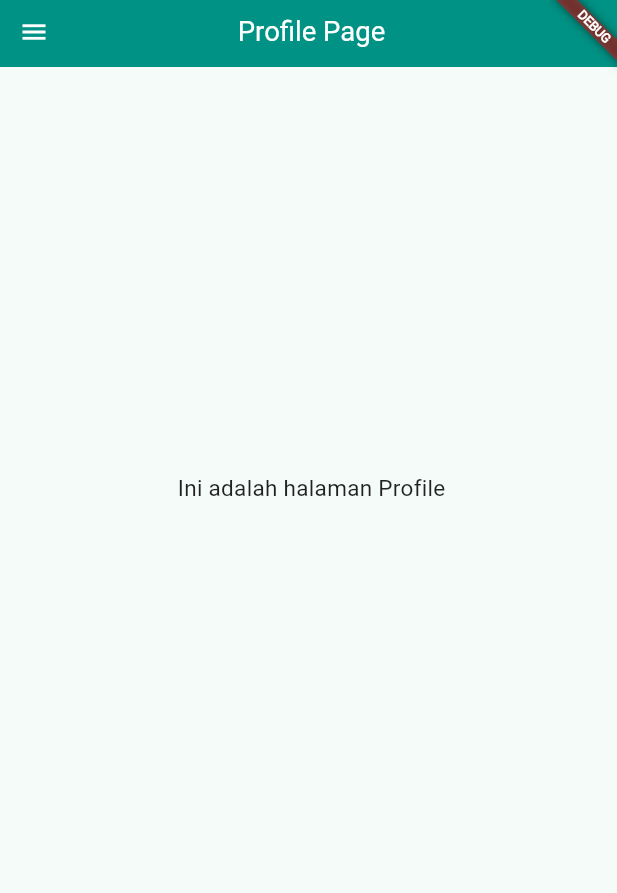

# prak3

A new Flutter project.

## Getting Started

This project is a starting point for a Flutter application.

A few resources to get you started if this is your first Flutter project:

- [Lab: Write your first Flutter app](https://docs.flutter.dev/get-started/codelab)
- [Cookbook: Useful Flutter samples](https://docs.flutter.dev/cookbook)

For help getting started with Flutter development, view the
[online documentation](https://docs.flutter.dev/), which offers tutorials,
samples, guidance on mobile development, and a full API reference.

## Screenshot

main.dart: main.dart adalah titik masuk aplikasi Flutter. Di dalamnya, fungsi main() memanggil runApp() untuk memulai aplikasi dengan widget utama MyApp. Kelas MyApp, yang merupakan turunan dari StatelessWidget, bertanggung jawab untuk membangun antarmuka pengguna dasar. Dalam metode build(), widget MaterialApp diciptakan, yang menyediakan kerangka kerja untuk aplikasi, termasuk pengaturan tema menggunakan ThemeData. 

login_page.dart: Di dalam login_page.dart, antarmuka pengguna untuk halaman login didefinisikan. Kelas LoginPage merupakan turunan dari StatefulWidget, memungkinkan pengelolaan status, seperti pengisian username dan password. Metode _showInput digunakan untuk membuat kolom input teks dengan placeholder, dan _showDialog untuk menampilkan dialog konfirmasi. Saat pengguna menekan tombol login, aplikasi memeriksa apakah username dan password yang dimasukkan benar. Jika benar, nama pengguna disimpan menggunakan SharedPreferences, dan pengguna dialihkan ke halaman HomePage; jika tidak, dialog muncul untuk memberi tahu kesalahan.

home_page.dart: home_page.dart mendefinisikan halaman utama aplikasi setelah pengguna berhasil login. Kelas HomePage juga merupakan turunan dari StatefulWidget, yang mengelola status pengguna. Dalam metode _loadUsername, aplikasi mengambil username yang disimpan dan menampilkannya di layar. Metode build() membuat struktur antarmuka dengan judul aplikasi dan menampilkan pesan yang menyapa pengguna berdasarkan username yang telah diambil. Halaman ini juga memiliki Drawer yang terhubung ke Sidemenu, menyediakan navigasi yang lebih mudah.

sidemenu.dart: File ini berisi Sidemenu, yang merupakan drawer navigasi untuk aplikasi. Sidemenu diimplementasikan sebagai StatelessWidget, menyajikan beberapa opsi navigasi, termasuk tautan ke halaman Home, About, dan Profile. DrawerHeader menampilkan gambar profil pengguna dan pesan sambutan. Setiap item ListTile mengandung ikon dan teks yang menunjukkan fungsi halaman yang berbeda. Saat diklik, pengguna dinavigasi ke halaman yang sesuai menggunakan Navigator.pushReplacement, memastikan bahwa halaman yang baru dibuka menggantikan halaman sebelumnya.

about_page.dart dan profile_page.dart: Kedua file ini mengikuti pola yang sama. AboutPage menyajikan informasi tentang aplikasi, sedangkan ProfilePage menunjukkan informasi pengguna. Keduanya menggunakan Sidemenu untuk navigasi, sehingga pengguna dapat kembali ke halaman lain dengan mudah. Setiap halaman diatur dengan AppBar dan pusat teks yang menjelaskan isi halaman. Hal ini menjaga konsistensi dalam tampilan dan pengalaman pengguna di seluruh aplikasi.

